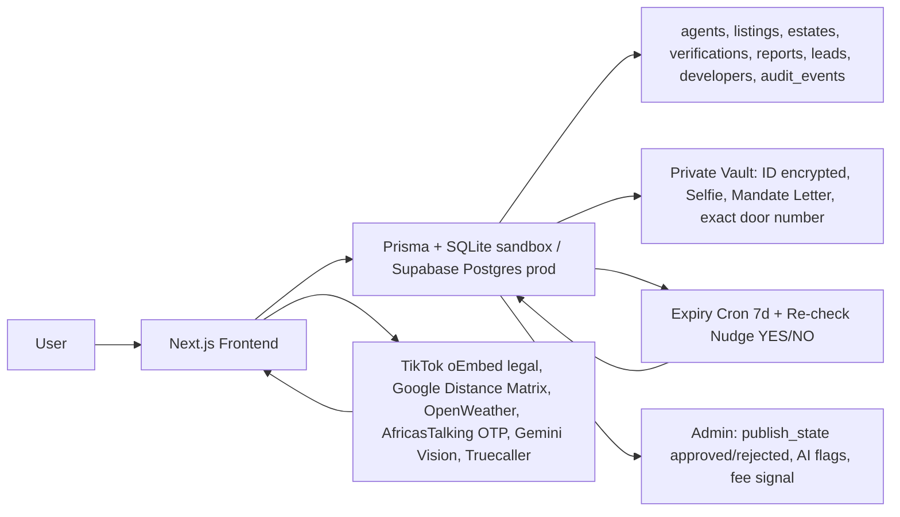
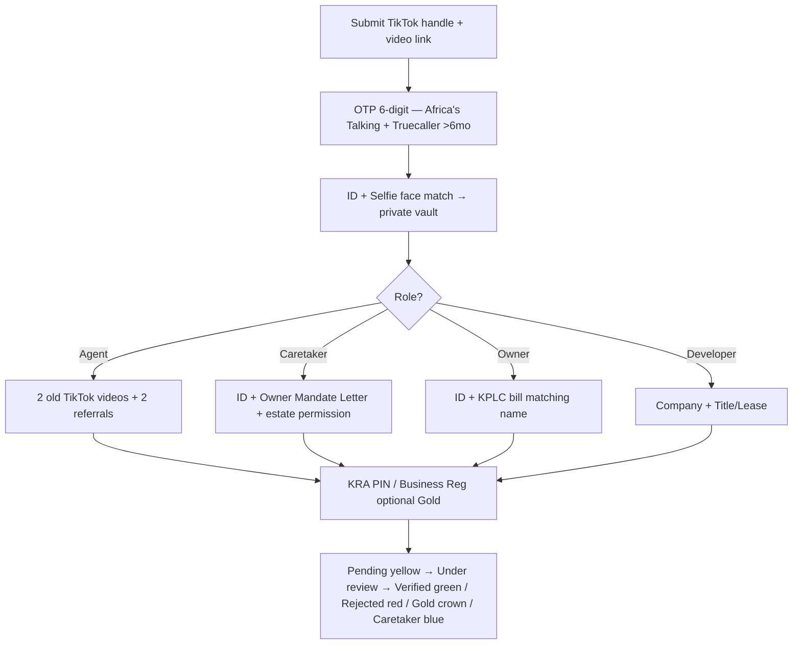
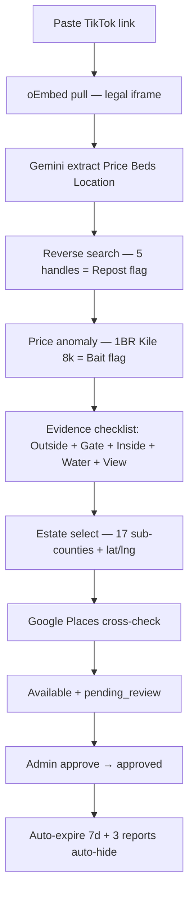
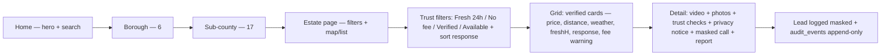
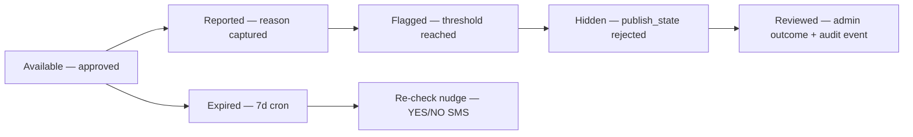
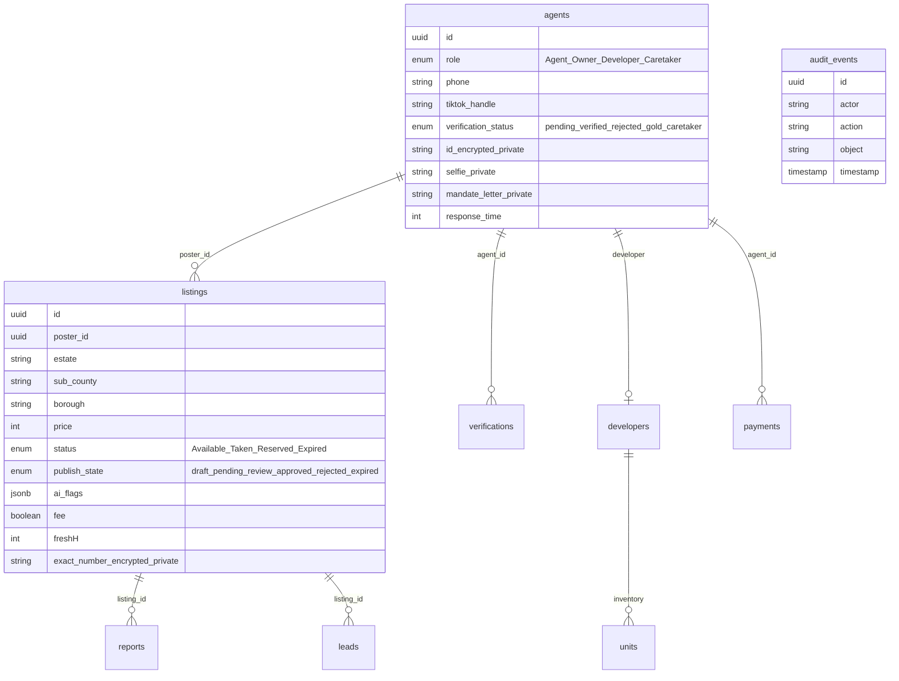
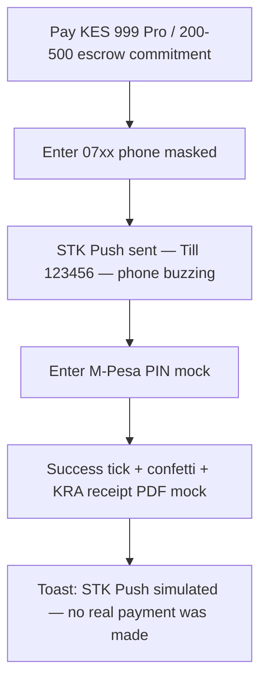

# Keja Halisi — Architecture (Mermaid)

## 1. System Architecture

## 2. Verification Flow (Agent / Caretaker / Owner / Developer)

## 3. Listing Verification Pipeline

## 4. Renter Journey

## 5. Trust State Machine

## 6. ERD (expanded)

## 7. M-Pesa STK Simulation Flow

